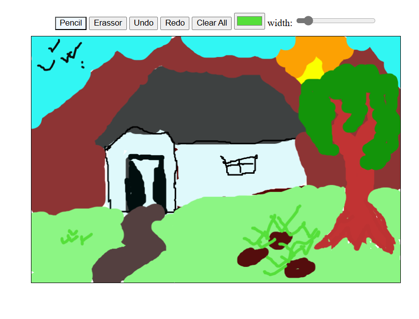

# 🎨 Drawing App

A simple and interactive web-based drawing application built using **HTML**, **CSS**, and **JavaScript**. This app allows users to express their creativity by drawing on a canvas using various brush sizes and colors.

## ✨ Features

- 🖌️ Freehand drawing on canvas
- 🎨 Color picker to choose brush color
- 📏 Adjustable brush size
- 🧼 Clear canvas button
- 💾 Option to save your drawing as an image

## 🔧 Tech Stack

- **HTML** – Canvas element for drawing
- **CSS** – Styling and layout
- **JavaScript** – Canvas rendering and user interaction handling

## 🚀 Getting Started

1. Clone the repository:

   ```bash
   git clone https://github.com/your-username/drawing-app.git
   cd drawing-app

## 📸 Preview


